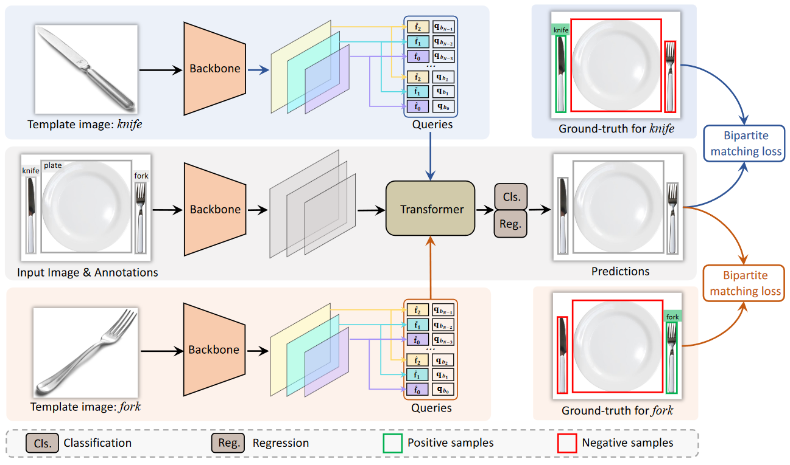

# Siamese-DETR

## Abstract

The ability to detect and track the dynamic objects in different scenes is fundamental to real-world applications, e.g., autonomous driving and robot navigation. However, traditional Multi-Object Tracking (MOT) is limited to tracking objects belonging to the pre-defined closed-set categories. Recently, Open-Vocabulary MOT (OVMOT) and Generic MOT (GMOT) are proposed to track interested objects beyond pre-defined categories with the given text prompt and template image. However, the expensive well pre-trained (vision-)language model and fine-grained category annotations are required to train OVMOT models. In this paper, we focus on GMOT and propose a simple but effective method, Siamese-DETR, for GMOT. Only the commonly used detection datasets (e.g., COCO) are required for training. Different from existing GMOT methods, which train a Single Object Tracking (SOT) based detector to detect interested objects and then apply a data association based MOT tracker to get the trajectories, we leverage the inherent object queries in DETR variants. Specifically: 1) The multi-scale object queries are designed based on the given template image, which are effective for detecting different scales of objects with the same category as the template image; 2) A dynamic matching training strategy is introduced to train Siamese-DETR on commonly used detection datasets, which takes full advantage of provided annotations; 3) The online tracking pipeline is simplified through a tracking-byquery manner by incorporating the tracked boxes in previous frame as additional query boxes. The complex data association is replaced with the much simpler Non-Maximum Suppression (NMS). Extensive experimental results show that Siamese-DETR surpasses existing MOT methods on GMOT-40 dataset by a large margin.

## Method



## Installation

<html>
  <summary>Installation</summary>
  
  We use the environment same to DINO to run Siamese-DETR. 
  We test our models under ```python=3.9.16, pytorch=1.13.1,cuda=11.7```. Other versions might be available as well. 

   1. Clone this repo
   ```sh
   https://github.com/yumu-173/gmot.git
   ```

   2. Install other needed packages
   ```sh
   conda create -n siamese-detr python===3.9
   conda install pytorch==1.13.1 torchvision==0.14.1 torchaudio==0.13.1 pytorch-cuda=11.7 -c pytorch -c nvidia
   pip install -r requirements.txt
   ```

   3. Compiling CUDA operators
   ```sh
   cd models/dino/ops
   python setup.py build install
   cd ../../..
   ```
</html>

## Data

<html>
  <summary>Data</summary>

Please download [COCO 2017](https://cocodataset.org/), [object365](https://www.objects365.org/overview.html), [GMOT-40](https://spritea.github.io/GMOT40/) dataset and organize them as following:
```
Dataset/
  ├── COCO/
    ├── annotations
    ├── train2017
    ├── val2017
  ├── object35/
    ├── annotations
    ├── train
  ├── GMOT-40/
    ├── gmot
      ├── airplane-0
      ├── ...
    ├── anno
```
</html>

## Train
  ```sh
  bash scripts/Siamese_DETR_train_coco_swint.sh Dataset/COCO /path/to/output-dir/ template-number
  bash scripts/Siamese_DETR_train_o365_swint.sh Dataset/object365 /path/to/output-dir/ template-number
  ```

## Test

  ```sh
  bash scripts/Siamese_DETR_test.sh
  ```

## Track
  ```sh
  bash scripts/Siamese_DETR_test_track.sh
  ```

## Bibcite

```sh
@article{liu2024siamese,
  title={Siamese-DETR for Generic Multi-Object Tracking},
  author={Liu, Qiankun and Li, Yichen and Jiang, Yuqi and Fu, Ying},
  journal={IEEE Transactions on Image Processing},
  year={2024},
  publisher={IEEE}
}
```